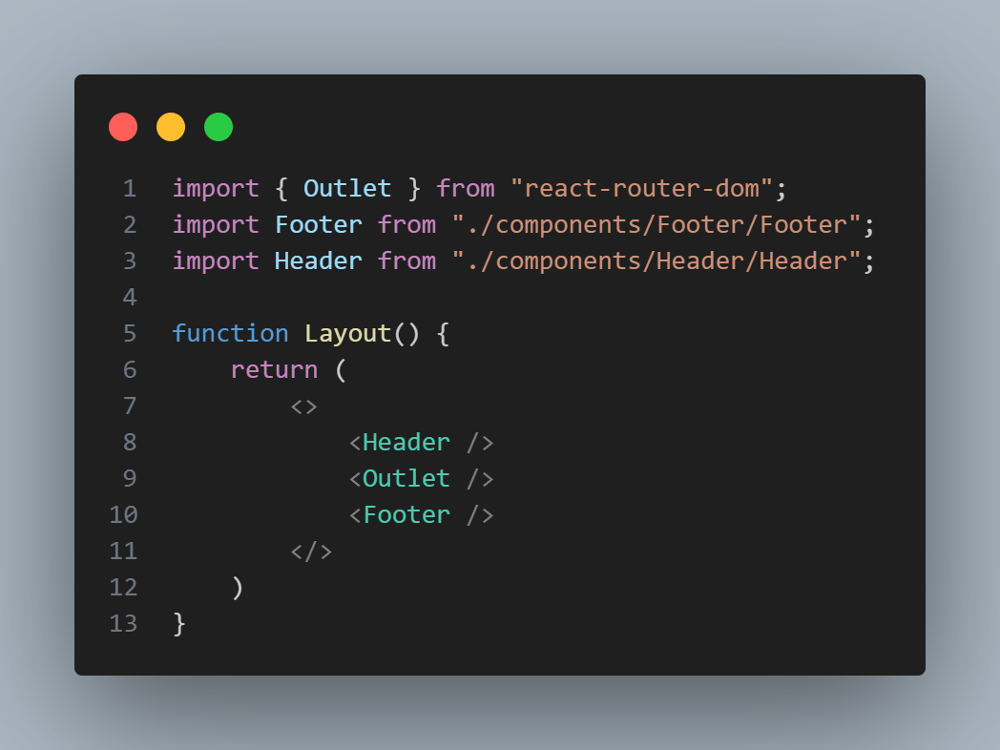
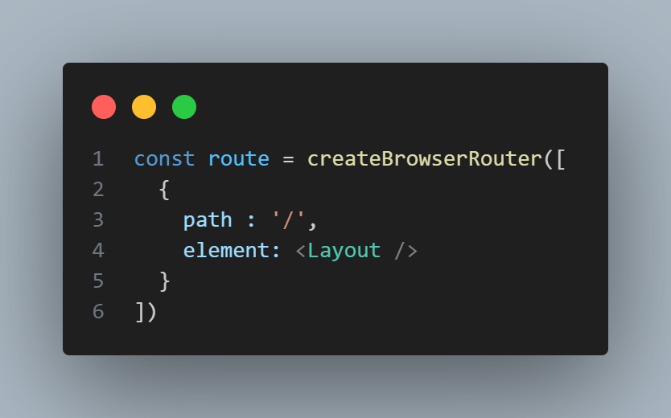
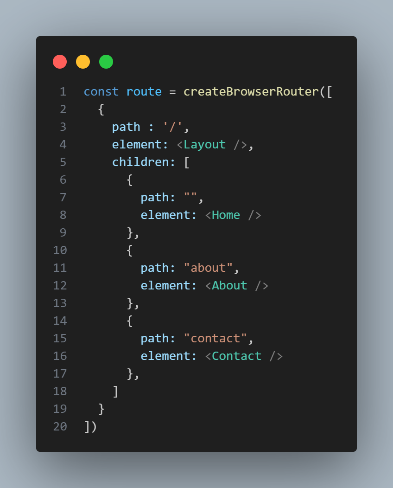
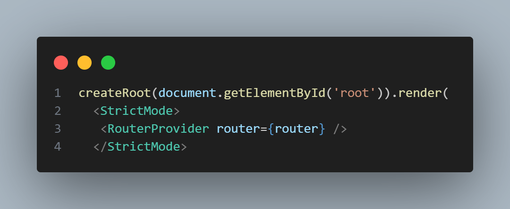
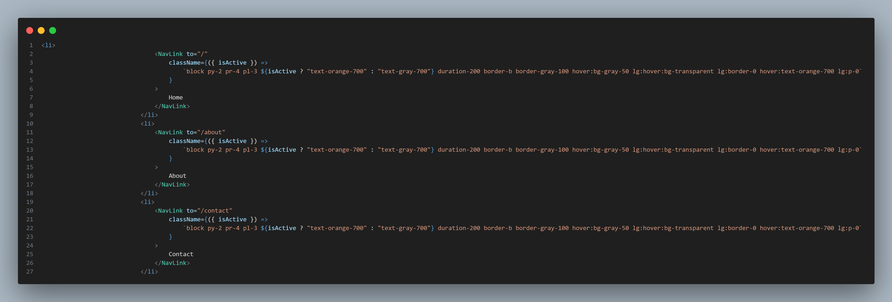

React Router is a standard library used in React applications to handle routing—that means switching between different views or pages without reloading the entire page. It makes your React app behave like a multi-page app, while actually running as a Single Page Application (SPA). 

## Step by step way to create a simple project using React Router

### Step-1: Create React-Vite Project 
For Creating React Project using Vite , first we need to 

```js
npm create vite@latest <YourProjectName>
```

after that go to your directory then

```bash
npm install
```

Then if you want to configure tailwind run this command

```bash
npm install tailwindcss @tailwindcss/vite
```

After that configure your vite.config.js file like this

```js
import { defineConfig } from 'vite'
import tailwindcss from '@tailwindcss/vite'
export default defineConfig({
  plugins: [
    tailwindcss(),
  ],
})
```
Add an @import to your CSS file that imports Tailwind CSS.

```css
@import "tailwindcss";
```

Start your build process
```bash
npm run dev
```

### Step-2: Create Components and install required Packages

Install the react router dom 

```bash
npm install react-router-dom
```


Create a components folder under src folder to create UI

### Step-3: Create a layout for our project (Optional)

Here we always wants the header and footer in the all pages , that's why we first define Header and at last we define Footer and we Dynamically push the component in between them using Outlet



### Step-4: Create Router in main.jsx

We will create a router using CreateBrowserRouter that will contains a object. The object basically contains two things , path and element

 

As We used Layout and we push the components dynamically we will add another things to that object which is "Children"
that children contains another Array of Object which actually refers to each page 


### Step-4: Create a RouterProvider and then pass the Router 




Till now we've completed the routing things , now we need to define this in Header's Navlink

That's how we can easily handle the routing in our project


### Param
In React Router, a param (short for parameter) is a dynamic part of the URL that you can capture and use inside your components. 

```js
  {
        path: "github/:username",
        element: <Github />
      }
```

To Access the url value you just need to import param like this and you can access the vlaue

```js
import { useParams } from "react-router-dom"

function GitHub(){

    const {username} = useParams()
    return (
        <>
        <h1>Username : {username} </h1>
        </>
    )
}

export default GitHub
```


Note: Routing parameter and varriable must be same , In my case it's' "username"


### React Router’s route configuration

It’s part of the routing system. In React Router v6.4+, loaders are attached to routes.

They run before the route’s component renders.


For Example , Now we are going to use the github API , So, When user hover or going to click on the github menu item, it automatically run the components and load it 


For Using this First we need to create a function. Here we named it "githubInfoLoader" and then export it 
After that we need to call the function from our Router

Function : 

```js
export const githubInfoLoader = async () => {
    const res = await fetch('https://api.github.com/users/Alvee3120')
    return res.json()
}
```

Router: 
```js
  {
        path: "github",
        loader:githubInfoLoader,
        element: <Github />
      }
```

And oviously we need to import it 
```js
import { useLoaderData } from 'react-router-dom'
```
And Define it
```js
const data = useLoaderData()
```

### Simple BreakDown 

First when user going to click on github menu  githubInfoLoader activated and it fetch the data from the given API , 
Then it will return the json file to useLoaderData( React Dom Router) , then we store  useLoaderData using a varriable name data. Though this Data we access the json

